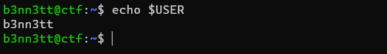

# dpkg

Simply put, **`dpkg`** is the yin to **`apt`**'s yang. We use **`apt`** for managing software from those big online repositories, leaving **`dpkg`** as your go-to when you want to get your hands on packages that are on your local machine.

Let's say you were surfing the web and snagged a **`.deb`** package with some software you fancy giving a whirl. If you...

1. Trust where it came from, and
2. Are sure it's not been messed with on its way to you...

You can't just use a simple **`apt install`** command to put it on your system. Nope, the job of installing, deleting, constructing, and overseeing **`.deb`** packages falls squarely on dpkg's shoulders. Let's dive into how it gets the job done.


### Installing a `.deb` File

Installing a **`.deb`** file is pretty simple. We use **`dpkg`** with the **`-i`** option:

```bash
sudo dpkg -i package_file_name.deb
```


Note that in this example, the package is in the same working directory and so the full path is not provided. If you need a quick reminder on relative vs absolute paths, [click here](../../../../getting-to-know-linux/moving-around-the-filesystem/)



### Listing Installed Packages

Much like we saw with **`apt`**, **`dpkg`** has the ability to list packages installed on the system:

```bash
dpkg -l
```

This will result in quite a lot of output:

<figure><figcaption><p>Typical output from dpkg package listing</p></figcaption></figure>

Remembering what we learned about [**expanding commands and piping**](../../../../getting-to-know-linux/using-the-shell/shell-commands/connecting-and-expanding-commands/piping-between-commands.md), we can be a little more creative with this command and generate some useful output. For example, we can leverage the **`wc`** (Word Count) command with its **`-l`** option to count the amount of lines of output. This will tell us how many packages are installed on the system:

```bash
dpkg -l | wc -l
```

<figure><figcaption><p>Amount of packages installed on local system</p></figcaption></figure>

We can also use **`grep`** to filter the output if we have a string to work with. Let's presume we want to know if **`python`** is installed on the system:

```
dpkg -l | grep -i python
```

<figure><figcaption><p>Filtering dpkg output with grep to find instances of python</p></figcaption></figure>

Interestingly, we see that the output filters on any instance of the string we provide, be it package name or description, so you may need to examine the output carefully to find what you're after. Once you have found your desired package, you can provide its name to dpkg to get more details information:

```
dpkg -l python3
```

<figure><figcaption><p>Detiled output of an installed package with dpkg</p></figcaption></figure>


### Removing Packages

Now that we've figured out how to put a package on our system and check out what's already there, it's time to master the art of kicking them out. Here's the deal: packages are found and identified by their **dpkg names**. Remember how we installed a **`.deb`** file earlier? Well, the name we used back then was just the file's name, not the actual package name. So, make sure you follow the steps above to spot the right package you want to say goodbye to.

Removing the package is pretty simple:

```bash
sudo dpkg -r package
```


### Reconfiguring Packages

We're almost done with **`dpkg`**, but before we move on there is one more feature you should know about. Every so often, for reasons that will become apparent as you gain more experience with Linux, packages can become corrupt. Yes, its super annoying, but **`dpkg`** can save us. Once you have found the package name that is corrupt (errors are a clue...) then you can issue the following command to reconfigure the package:

```bash
sudo dpkg --configure <package-name>
```



**Pro Tip**\
Many **`dpkg`** tasks can also be run through the more user-friendly **`apt`** despite the general use cases as described above. A quick google will show you everything you need to know - git it a go!

