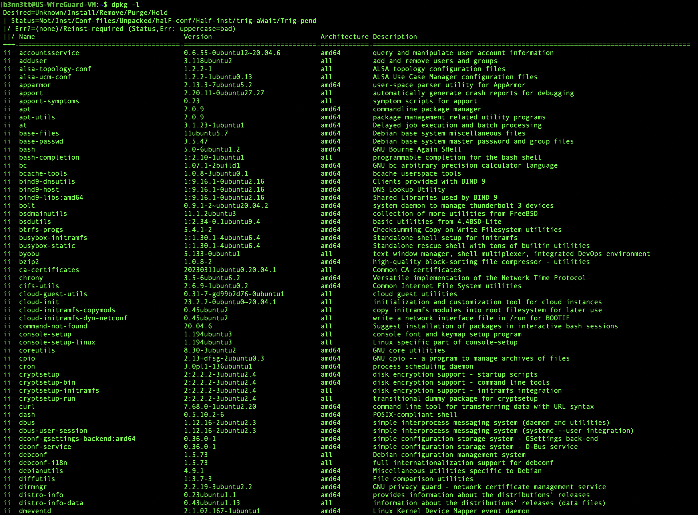

# Managing Software from the Desktop

Ubuntu contains within it an app store of sorts called the **Software Center**. It is a utility for installing, purchasing, and managing software in Ubuntu. It provides a user-friendly graphical interface that allows users to browse and install thousands of applications available.

Key features of the Ubuntu Software Center include:

1. **Software Browsing and Search**\
   Users can browse through categories of software or search for applications by name or description
2. **Software Installation and Removal**\
   It simplifies the process of software installation. Users can install or remove software with just a few clicks
3. **Software Management**\
   The center keeps track of all installed software and provides updates when available
4. **Paid and Free Software**\
   It includes both free and paid software offerings, giving developers a platform to distribute their applications
5. **User Reviews and Ratings**\
   Users can read reviews and ratings for software written by other users, which can help in deciding which applications to install
6. **One-Click Install**\
   For many applications, installation is as simple as clicking the "Install" button and entering your password - nice!

<figure><figcaption>
Ubuntu's software center
</figcaption></figure>

If you're using Linux just for everyday stuff like writing up some documents, playing music, and the usual desktop bits and bobs, the Software Center should do you just fine. Straight out of the box, your system's hooked up to Ubuntu's main software shop, with hundreds of apps for you to choose from. Plus, you've got the choice to snag third-party apps that are freebies for your use, though you can't pass them on.

Now, while the Software bit lets you pick and choose a few apps from Ubuntu's vast cupboard of software goodies, there's a shedload more – we're talking tens of thousands – tucked away in there. So, what's off the menu from that repository? When would you ever need to dig around for those hidden gems? And if you fancy those or want to poke around in other software treasure chests, how do you get your hands on them?
