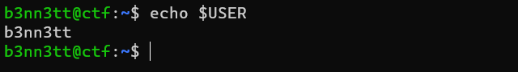

# Shell Variables

The shell itself stores information that may be useful to the user’s shell session in what are called variables. Examples of variables include:

* `$SHELL` - Identifies the shell you are using
* `$PS1` - Defines your shell prompt
* `$MAIL` - Identifies the location of your user’s mailbox

You can see all variables set for your current shell by typing the **set** command. A subset of your local variables is referred to as **environment variables**. Environment variables are variables that are exported to any new shells opened from the current shell. Type `env` to see environment variables:

```text
env
```


You can type `echo $VALUE`, where VALUE is replaced by the name of a particular environment variable you want to list. 

Because there are always multiple ways to do anything in Linux, you can also type `declare` to get a list of the current environment variables and their values along with a list of shell functions.

Besides those that you set yourself, system files set variables that store things such as locations of configuration files, mailboxes, and path directories. They can also store values for your shell prompts, the size of your history list, and type of operating system. You can refer to the value of any of those variables by preceding it with a dollar sign `$` and placing it anywhere on a command line. For example:



When you start a shell \(by logging in via a virtual console or opening a Terminal window\), many environment variables are already set. The subnode shows some variables that are either set when you use a bash shell or that can be set by you to use with different features.


